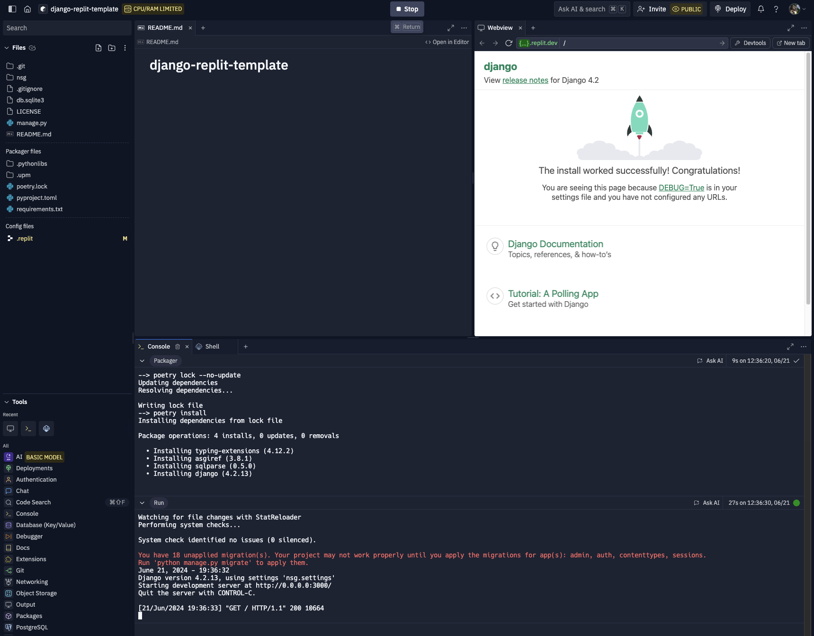

# National Services Group - Pair programming interview environment

This repo is a minimal Django development envionment for using
[Replit](https://replit.com/) to conduct a pair programming Django exercise
during our interview process.

## For the Interviewer

### Getting Started with Replit

To get started, navigate to [Replit](https://replit.com/) and create an account.

Once signed up, you’ll be taken to the dashboard where you can create a new application.

Create an application by selecting the plus icon as shown in the screenshot below.

After clicking on the plus sign, a modal will appear where you can "Import from GitHub", where you will enter `https://github.com/NationalServicesGroup/django-replit-template.git` as the URL to import.

From there you will accept the defaults and click "Confirm and close" in the "Configure your Repl" section.

To share out the Repl, click "Invite" in the top right corner, toggle the "Private join link" toggle and click "Copy join link".  Share this link with the interviewee.

When you click "Run" at the top of the screen, it will install the needed packages / libraries, and start the Django application.  Under the hood, Replit is configured to run `python manage.py runserver 0.0.0.0:3000` when you click run.  And port `3000` has been mapped to port `80` for the environment.

There is an option to get a shell in the bottom frame, from which you can run command like `python manage.py migrate`. 

When done, click on the `django-replit-template` name in the top left, then click the three vertical dots, and then click "Delete".

## For the Interviewee

